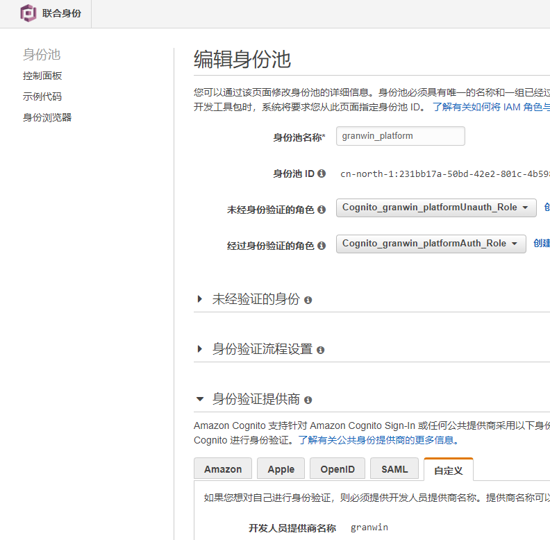

# 创建身份池
## 注意：
### 1.身份验证供应商 -> 自定义 -> 开发人员提供商名称 （这个是demo中的  providerName  ）


### 2.身份池 ID 也是demo中用到的参数



# 创建事务
## 按步骤创建事务
demo中的策略均以事务  ”ZYJTEST001“  所生成策略


 

## 策略内容如下:
```{
    "Version": "2012-10-17",
    "Statement": [
        {
            "Effect": "Allow",
            "Action": [
                "iot:Connect"
            ],
            "Resource": [
                "arn:aws-cn:iot:*:accountId:client/ZYJTEST001"
            ]
        },
        {
            "Effect": "Allow",
            "Action": [
                "iot:Publish"
            ],
            "Resource": [
                "arn:aws-cn:iot:*:accountId:topic/$aws/things/ZYJTEST001/shadow/*",
                "arn:aws-cn:iot:*:accountId:topic/productKey/ZYJTEST001/*",
                "arn:aws-cn:iot:*:accountId:topic/$aws/rules/*"
            ]
        },
        {
            "Effect": "Allow",
            "Action": [
                "iot:Receive"
            ],
            "Resource": [
                "arn:aws-cn:iot:*:accountId:topic/$aws/things/ZYJTEST001/shadow/*",
                "arn:aws-cn:iot:*:accountId:topic/productKey/ZYJTEST001/*"
            ]
        },
        {
            "Effect": "Allow",
            "Action": [
                "iot:Subscribe"
            ],
            "Resource": [
                "arn:aws-cn:iot:*:accountId:topicfilter/$aws/things/ZYJTEST001/shadow/*",
                "arn:aws-cn:iot:*:accountId:topicfilter/productKey/ZYJTEST001/*"
            ]
        }
    ]
}
```

    


# demo运行结果


与demo中的一致


